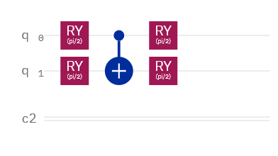
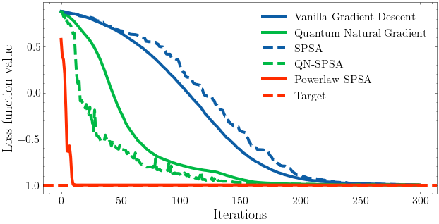

# Quantum Machine Learning

## Quantum Gradient Descent

How to train quantum circuit-based models using gradient based methods ?

The goal in the case where we train a parameterized quantum circuit model is to minimize the cost or loss function which is the objective function via the vector of parameters. 

The expectation value is what we’d expect to measure if we averaged out a large number of results.

The quantum approach has two fundamental steps :

1. Prepare the quantum state $|\Psi(\vec{\theta})\rangle$ called the *ansatz*
2. Measure the expectation value $\langle\Psi(\vec{\theta})|\hat{H}|\Psi(\vec{\theta})\rangle$

We define our ansatz $|\Psi(\vec{\theta})\rangle = U(\vec{\theta})|0\rangle$ with $U(\vec{\theta})$ the parametrized quantum circuit.

We can see that the different quantum natural gradients approach the target faster than vanilla gradient descent.

- Simultaneous Perturbation Stochastic Approximation (SPSA) 
- The Quantum Natural SPSA (QN-SPSA) 
- Powerlaw SPSA : automatically calibrate the learning rate 

### Limitations (Barren plateaus)

...

### References

1. Maria Schuld, Ville Bergholm, Christian Gogolin, Josh Izaac and Nathan Killoran, *Evaluating analytic gradients on quantum hardware*, Physical Revview A 99, 032331 (2019), [doi:10.1103/PhysRevA.99.032331](https://journals.aps.org/pra/abstract/10.1103/PhysRevA.99.032331), arXiv:1811.11184.

2. James Stokes, Josh Izaac, Nathan Killoran and Giuseppe Carleo, *Quantum Natural Gradient*, Quantum 4, 269 (2020), [doi:10.22331/q-2020-05-25-269](https://doi.org/10.22331/q-2020-05-25-269), arXiv:1909.02108.

3.    Julien Gacon, Christa Zoufal, Giuseppe Carleo and Stefan Woerner, *Simultaneous Perturbation Stochastic Approximation of the Quantum Fisher Information*, arXiv:2103.09232.

4.    Jarrod R. McClean, Sergio Boixo, Vadim N. Smelyanskiy, Ryan Babbush and Hartmut Neven, *Barren plateaus in quantum neural network training landscapes*, Nature Communications, Volume 9, 4812 (2018), [doi:10.1038/s41467-018-07090-4](https://www.nature.com/articles/s41467-018-07090-4), arXiv:1803.11173.

5.    M. Cerezo, Akira Sone, Tyler Volkoff, Lukasz Cincio and Patrick J. Coles, *Cost Function Dependent Barren Plateaus in Shallow Parametrized Quantum Circuits*, Nature Communications 12, 1791 (2021), [doi:10.1038/s41467-021-21728-w](https://www.nature.com/articles/s41467-021-21728-w), arXiv:2001.00550.
    
